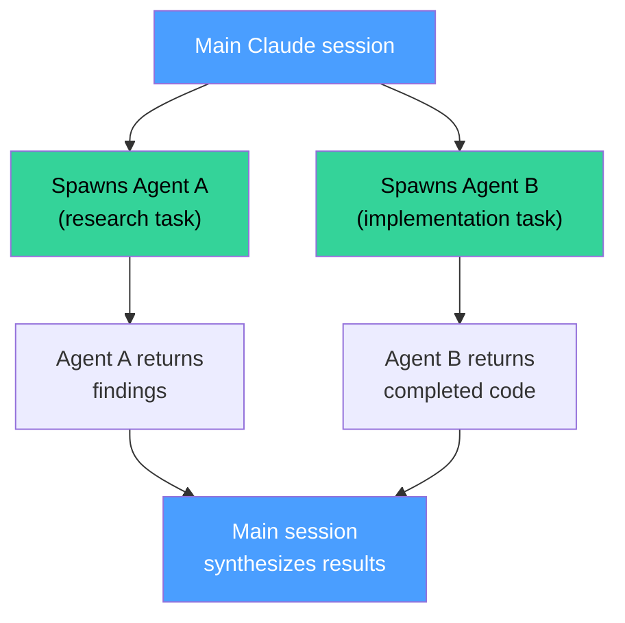

# Claude Code Agents

> **At a glance** — Agents are specialized sub-processes that Claude spawns for complex, multi-step tasks. They run in isolation with their own context window, can execute in parallel, and return results when done. Use agents when a task is too large or complex for a single conversation turn.

---

## What Are Agents?

When Claude Code encounters a complex task — like reviewing an entire codebase, running a multi-step analysis, or implementing changes across many files — it can spawn an **agent** to handle it. The agent:

- Runs as a separate process with its own context
- Has access to specific tools you define
- Works independently (even in the background)
- Returns a summary when complete



## When to Use Agents vs Skills vs Commands

| Situation | Best Tool | Why |
|-----------|-----------|-----|
| Quick, automatic help | **Skill** | Auto-discovered, no invocation needed |
| Explicit action you trigger | **Command** | `/project:X` — predictable |
| Complex multi-file analysis | **Agent** | Isolated context, doesn't pollute your session |
| Parallel tasks | **Agent** | Multiple agents run simultaneously |
| Long-running research | **Agent** | Runs in background, notifies when done |
| Simple code review | **Command** | `/project:review` is sufficient |
| Full codebase audit | **Agent** | Needs its own context for the scope |

> [!TIP]
> **Rule of thumb:** If a task would take more than 3 tool calls and touches more than 3 files, consider an agent. Otherwise, a skill or command is simpler.

## Agent File Format

```yaml
---
name: agent-name                    # Unique identifier
description: >-                     # What this agent does
  Detailed description of the agent's purpose and capabilities.
model: sonnet                       # Optional: sonnet, opus, haiku
tools: Bash, Read, Write, Grep      # Tools the agent can use
---
```

The body of the agent file contains instructions for what the agent should do when spawned — the task definition, methodology, output format, and quality criteria.

## Creating a Custom Agent

1. Create a `.md` file in this directory
2. Add YAML frontmatter with `name`, `description`, `tools`
3. Write the agent's instructions in the body
4. Claude will use the agent when the task matches

> [!NOTE]
> Agents are referenced by name when spawned. Unlike skills (auto-discovered), agents are explicitly invoked by Claude when it determines the task requires one. You can also request a specific agent: "Use the code-review agent to check this PR."

## Example Agents for Common Projects

| Agent | Purpose | When Spawned |
|-------|---------|-------------|
| Code reviewer | Multi-file review with security + performance checks | Large PRs, pre-merge review |
| Test generator | Analyze code and generate comprehensive test suites | "Add tests for this module" |
| Migration planner | Analyze schema changes and plan safe migrations | Database schema changes |
| Documentation updater | Scan code changes and update affected docs | After significant code changes |
| Security auditor | Full codebase security scan | Pre-deployment, periodic audits |

## See Also

- [Skills README](../skills/README.md) — for automatic, proactive capabilities
- [Commands](../commands/) — for user-invoked tools
- [Example agent](_example-agent.md) — a complete, working agent you can customize
- [Anthropic Docs: Agents](https://docs.anthropic.com/en/docs/claude-code/sub-agents)
