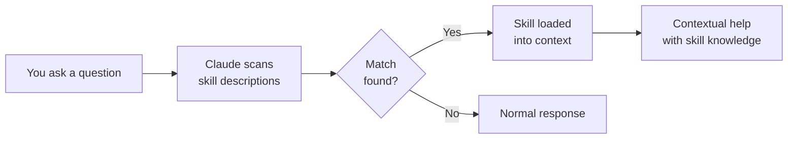

# Claude Code Skills

> **At a glance** — Skills are project-specific capabilities that Claude auto-discovers based on description matching. Unlike commands (which you invoke with `/project:X`), skills fire automatically when your request matches what they do. Put skills here to make Claude smarter about YOUR project.

---

## What Are Skills?

When you ask Claude Code a question or request a task, it scans the `description` field of every skill file in this directory. If your request matches a skill's description, Claude loads that skill and uses it — without you having to invoke anything.



**Example:** If you have a skill with description `"Check database migrations for safety issues"`, and you say "review this migration file," Claude will automatically use that skill — you don't type a command.

## Skills vs Commands vs Agents

| Need | Use | Why |
|------|-----|-----|
| **Proactive, automatic help** | Skill | Auto-discovered when context matches |
| **Explicit tool, user invokes** | Command (`/project:X`) | Predictable, only fires when asked |
| **Complex multi-step task** | Agent | Isolated context, can run in parallel |

> [!TIP]
> **Start with commands.** Skills are powerful but consume context tokens on every session (Claude scans their descriptions). Add a skill when you find yourself repeatedly invoking the same command — that's the signal it should be auto-discovered.

## Your First Skill in 2 Minutes

Create a file in this directory with `.md` extension:

```markdown
---
name: my-project-helper
description: >-
  Help with [your project] by checking [specific thing].
  Use when [trigger condition].
---

# My Project Helper

## When to Activate
- User asks about [topic]
- User is working with [file type]

## What to Do
1. Check [thing]
2. Suggest [improvement]
3. Reference [docs]
```

**The `description` field is everything.** It determines when Claude uses the skill. Be specific:
- Bad: `"Helps with the project"` (too vague, matches everything)
- Good: `"Check Python database migrations for backward compatibility issues, missing rollback steps, and data loss risks"` (specific, Claude knows exactly when to fire)

## Skill File Format

```yaml
---
name: skill-name              # Unique identifier
description: >-               # CRITICAL: this is what Claude matches against
  What the skill does and when to use it.
  Include keywords that would appear in user requests.
allowed-tools: Bash, Read, Grep  # Optional: limit which tools the skill can suggest
---
```

> [!IMPORTANT]
> **Context budget:** Every skill's description is scanned on every Claude Code session. Keep descriptions under 200 words. If you have 10+ skills, consider consolidating.

## Example Skills for Common Projects

| Skill | Description | Good For |
|-------|-------------|----------|
| API endpoint checker | Validates REST endpoints follow project conventions | Backend projects |
| Component reviewer | Checks React/Vue components for accessibility | Frontend projects |
| Migration safety | Reviews database migrations for data loss risks | Any project with a DB |
| Dependency auditor | Checks for outdated or vulnerable dependencies | All projects |
| Test coverage gaps | Identifies untested code paths | All projects |

## See Also

- [Agents README](../agents/README.md) — for complex, multi-step tasks
- [Commands](../commands/) — for explicit, user-invoked tools
- [Example skill](_example-skill.md) — a complete, working skill you can customize
- [Anthropic Docs: Skills](https://docs.anthropic.com/en/docs/claude-code/skills)
