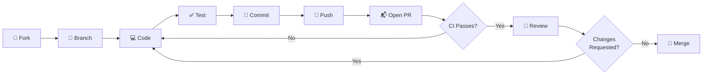

# Contributing

> **At a glance:** Fork the repo, create a branch, make changes with tests, open a PR. We use conventional commits and require CI to pass before merging. Secret scanning hooks are strongly recommended.

Thank you for your interest in contributing!

## Quick Reference

| Step | Command / Link |
|------|---------------|
| Fork | Click **Fork** on the repo page |
| Clone | `git clone https://github.com/YOUR_USERNAME/REPO_NAME.git` |
| Branch | `git checkout -b feature/your-feature` |
| Commit | `git commit -m "feat: describe your change"` |
| Push | `git push origin feature/your-feature` |
| Pull Request | Open a PR from your fork to `main` |
| Conventions | [Conventional Commits](https://www.conventionalcommits.org/) |
| Code of Conduct | [CODE_OF_CONDUCT.md](CODE_OF_CONDUCT.md) |

## Getting Started

1. Fork the repository
2. Clone your fork locally
3. Create a feature branch: `git checkout -b feature/your-feature`
4. Make your changes
5. Push to your fork
6. Open a Pull Request

## 🔀 PR Workflow



## Development Workflow

### Setting Up

```bash
# Clone the repository
git clone https://github.com/YOUR_USERNAME/REPO_NAME.git
cd REPO_NAME

# Install dependencies (adapt to your stack)
npm install        # Node.js
pip install -r requirements.txt  # Python
go mod download    # Go
```

### Making Changes

1. Write clear, focused commits
2. Follow existing code patterns
3. Add tests for new functionality
4. Update documentation as needed

### Running Tests

```bash
# Adapt to your stack
npm test           # Node.js
pytest             # Python
go test ./...      # Go
```

### Commit Messages

We use [Conventional Commits](https://www.conventionalcommits.org/):

| Prefix | Purpose |
|--------|---------|
| `feat:` | New feature |
| `fix:` | Bug fix |
| `docs:` | Documentation changes |
| `test:` | Adding/updating tests |
| `refactor:` | Code refactoring |
| `chore:` | Maintenance tasks |

Example: `feat: add user authentication`

> [!TIP]
> Want to enforce conventional commits automatically? Copy the commitlint config:
> ```bash
> cp templates/linting/commitlint.config.js.template commitlint.config.js
> npm install -D @commitlint/cli @commitlint/config-conventional
> ```

## Code Style

- Follow existing patterns in the codebase
- Keep functions small and focused
- Write self-documenting code
- Add comments for complex logic only

## 🔒 Pre-commit Hooks

### Secret Scanning (Recommended for All Projects)

> [!TIP]
> Set up secret scanning in under a minute. This single step prevents the most common and costly security mistake — accidentally committing credentials.

Install the secret scanning pre-commit hook to catch accidental credential commits:

```bash
bash templates/hooks/setup-hooks.sh
```

This installs a hook that blocks commits containing API keys, private keys, credentials, and tokens you configure in `.git/hooks/forbidden-tokens.txt`. If a detection is a false positive, the hook tells you how to proceed.

> [!TIP]
> If you already have a pre-commit hook (husky, lint-staged, etc.), the installer chains them — your existing hook is preserved. Hooks are also backed up to `~/.config/repo-template/hooks/` so they survive recloning.

> [!NOTE]
> **For contributors modifying hooks:** Use POSIX-compatible regex patterns (`[[:space:]]` not `\s`, `[[:alpha:]]` not `\w`) for cross-platform compatibility. BSD grep on macOS doesn't support Perl-style character classes.

### Linting Hooks (Optional)

For JavaScript/TypeScript projects, you can add linting pre-commit hooks:

```bash
# Install husky and lint-staged
npm install -D husky lint-staged

# Initialize husky
npx husky init

# Add pre-commit hook
echo "npx lint-staged" > .husky/pre-commit
```

Create `.lintstagedrc.json`:

```json
{
  "*.{js,ts,jsx,tsx}": ["eslint --fix", "prettier --write"],
  "*.{json,md,yml}": ["prettier --write"]
}
```

For Python projects:

```bash
# Install pre-commit
pip install pre-commit

# Create .pre-commit-config.yaml and run
pre-commit install
```

## Pull Requests

- Fill out the PR template completely
- Reference related issues
- Keep PRs focused and reasonably sized
- Ensure CI passes before requesting review

## 🔐 Security

> [!IMPORTANT]
> Never commit secrets, API keys, or credentials. Use `.env` files (which are gitignored). If you discover a security vulnerability, **do not open a public issue**. Follow responsible disclosure via [SECURITY.md](SECURITY.md).

> [!WARNING]
> If you accidentally commit a secret, **rotate it immediately** — removing it from git history alone is not sufficient. See the [incident runbook](SECURITY.md#what-to-do-if-a-secret-is-leaked) for the full procedure.

## Questions?

Open an issue if you have questions or need help. See [SUPPORT.md](SUPPORT.md) for all support options.

---

> **See also:** [CLAUDE.md](CLAUDE.md) | [AGENTS.md](AGENTS.md) | [docs/ARCHITECTURE.md](docs/ARCHITECTURE.md) | [SECURITY.md](SECURITY.md) | [CODE_OF_CONDUCT.md](CODE_OF_CONDUCT.md)
