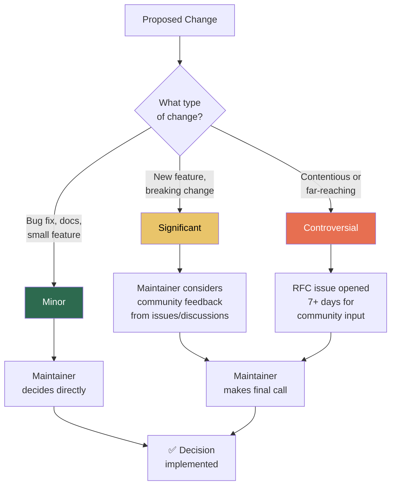
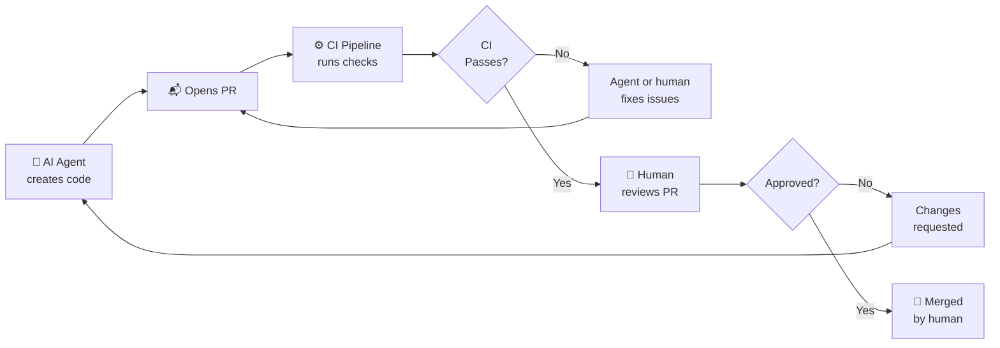

# Governance

> **Governance at a glance:** Solo maintainer model with final authority on all decisions. AI agents are treated as contributors, not maintainers — they work via PRs, go through CI, and cannot self-approve. All participants follow the [Code of Conduct](CODE_OF_CONDUCT.md).

This document describes how the project is run and how decisions are made.

## Governance Model

This project uses a **solo maintainer** (benevolent dictator) model. The maintainer has final authority on all decisions, including features, releases, and community standards.

<!-- ============================================================
     TEAM MODEL ALTERNATIVE
     Uncomment this section if your project has multiple maintainers.
     ============================================================

## Governance Model

This project uses a **team maintainer** model with the following roles:

### Roles

| Role | Responsibilities | Members |
|------|-----------------|---------|
| **Lead Maintainer** | Final decision authority, releases, security | @your-username |
| **Maintainer** | Code review, issue triage, feature development | @teammate |
| **Contributor** | Bug fixes, features, documentation | Anyone with merged PR |

### Becoming a Maintainer

Contributors who demonstrate sustained, high-quality contributions may be invited
to become maintainers. Criteria include:

- Consistent contributions over 3+ months
- Constructive code reviews
- Helping other contributors
- Understanding of project goals and architecture

================================================================ -->

## ⚖️ Decision-Making

> [!NOTE]
> All decision types ultimately rest with the maintainer. The difference is the amount of community input sought before deciding. Even for minor changes, the maintainer may open a discussion if the impact is unclear.

1. **Minor changes** (bug fixes, documentation, small features) — the maintainer decides.
2. **Significant changes** (new features, breaking changes, architecture) — the maintainer decides after considering community feedback from issues and discussions.
3. **Controversial changes** — the maintainer opens a discussion or RFC issue, allows community input for at least 7 days, then decides.

## Conflict Resolution

1. Discuss in the relevant issue or PR.
2. If unresolved, the maintainer makes the final call.
3. All participants must follow the [Code of Conduct](CODE_OF_CONDUCT.md).

## 🤖 AI Agent Governance

AI coding agents (Claude Code, GitHub Copilot, Cursor, Gemini, Windsurf, etc.) are treated as contributors, not maintainers.

### Rules for AI Agents

> [!IMPORTANT]
> AI agents operate under the same contribution standards as human contributors, with additional restrictions to prevent prompt injection and unauthorized access.

| Rule | Rationale |
|------|-----------|
| **Work via pull requests** | Agents must never push directly to protected branches |
| **Subject to CI** | All agent-generated code goes through the same CI checks as human code |
| **No self-approval** | Agents cannot approve their own PRs |
| **AI config changes require owner review** | See below |
| **Transparency** | Agent-generated commits include a co-author trailer |

> [!WARNING]
> **AI config changes require owner review** — Modifications to `CLAUDE.md`, `AGENTS.md`, `GEMINI.md`, `.cursorrules`, `.windsurfrules`, or `.github/copilot-instructions.md` must be reviewed by a human maintainer. These files control agent behavior, making them prompt injection targets.

### Why This Matters

AI agent config files are a prompt injection vector. An attacker could submit a PR that modifies `CLAUDE.md` to instruct the agent to exfiltrate secrets or bypass security checks. CODEOWNERS protection on these files ensures a human reviews any changes. See [docs/AI-SECURITY.md](docs/AI-SECURITY.md) for details.

## 📦 Releases

- The maintainer decides when to release.
- Releases follow [Semantic Versioning](https://semver.org/).
- Each release has a GitHub Release with changelog notes.

## Amendments

This governance document can be amended by the maintainer. Significant changes will be communicated via a GitHub Discussion or issue.

---

> **See also:** [CONTRIBUTING.md](CONTRIBUTING.md) | [SECURITY.md](SECURITY.md) | [CODE_OF_CONDUCT.md](CODE_OF_CONDUCT.md) | [docs/AI-SECURITY.md](docs/AI-SECURITY.md)
