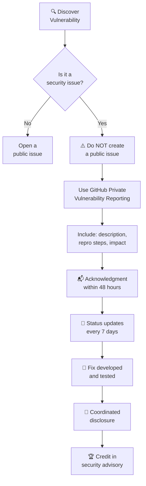

# Security Policy

> **Security at a glance:** We follow a 6-layer defense model — from GitHub-native features through pre-commit hooks to runtime protection. Vulnerabilities should be reported privately via GitHub's advisory system. If a secret is leaked, rotate first, clean history second.

## 🛡️ Security Model

```mermaid
block-beta
    columns 1
    block:layers
        L1["Layer 1: GitHub-Native Security\nSecret scanning · Push protection · Dependabot alerts · CodeQL"]
        L2["Layer 2: Pre-commit Hooks\nSecret scanning hook · Forbidden tokens · POSIX-compatible patterns"]
        L3["Layer 3: CI Pipeline\nAutomated tests · Linting · SHA-pinned Actions · Branch protection"]
        L4["Layer 4: Code Review\nCODEOWNERS on sensitive files · Human review of AI config changes"]
        L5["Layer 5: Access Control\nBranch protection · Signed commits · Least-privilege permissions"]
        L6["Layer 6: Runtime & Monitoring\nAudit logs · Dependency monitoring · Incident response plan"]
    end

    style L1 fill:#2d6a4f,color:#fff
    style L2 fill:#40916c,color:#fff
    style L3 fill:#52b788,color:#fff
    style L4 fill:#74c69d,color:#000
    style L5 fill:#95d5b2,color:#000
    style L6 fill:#b7e4c7,color:#000
```



## 📋 Reporting a Vulnerability

We take security seriously. If you discover a security vulnerability, please report it responsibly.



### How to Report

> [!IMPORTANT]
> **Do NOT create a public GitHub issue** for security vulnerabilities. Use private reporting to protect users while a fix is developed.

1. Use [GitHub's private vulnerability reporting](https://docs.github.com/en/code-security/security-advisories/guidance-on-reporting-and-writing-information-about-vulnerabilities/privately-reporting-a-security-vulnerability) (preferred)
2. Or email: <!-- TODO: Add your security contact email -->

### What to Include

- Description of the vulnerability
- Steps to reproduce
- Potential impact
- Suggested fix (if any)

### Response Timeline

| Action | Timeframe |
|--------|-----------|
| Acknowledgment | Within 48 hours |
| Status update | Every 7 days |
| Resolution | Depends on severity |

### After Resolution

- We'll coordinate disclosure timing with you
- With permission, we'll credit you in the security advisory

## Supported Versions

<!-- TODO: Update with your version support policy -->

| Version | Supported |
|---------|-----------|
| Latest | Yes |
| Previous major | Security fixes only |
| Older | No |

## 🔐 Security Best Practices

This repository follows security best practices:

| Practice | Status | Description |
|----------|--------|-------------|
| Dependabot | Enabled | Monitors dependencies for known vulnerabilities |
| SHA-pinned Actions | Enforced | GitHub Actions pinned to commit SHA, not tags |
| Secret scanning hook | Available | Pre-commit hook blocks credential commits |
| Push protection | Recommended | Blocks pushes containing detected secrets |
| CODEOWNERS | Configured | Sensitive files require maintainer review |

## Enabling Additional Security Features

In your repository settings, consider enabling:

1. **Secret scanning** - Detects committed secrets
2. **Push protection** - Blocks pushes with secrets
3. **Dependabot alerts** - Notifies of vulnerable dependencies
4. **Code scanning** - Finds vulnerabilities via CodeQL

> [!TIP]
> Run the automated security setup to configure all recommended features at once:
> ```bash
> bash scripts/secure-repo.sh
> ```

See [GitHub Security Features](https://docs.github.com/en/code-security) for manual setup instructions.

## 🚨 What To Do If a Secret Is Leaked

> [!CAUTION]
> **Time is critical.** A leaked credential can be exploited within minutes. Follow these steps in order — rotation comes first because history rewriting alone is not sufficient to protect you.

If a secret (API key, password, token, credential) is accidentally committed:

1. **Rotate the credential immediately** — this is the ONLY reliable mitigation. Do this BEFORE anything else.
2. **Check for unauthorized access** — review audit logs for the affected service to see if the credential was used.
3. **Remove from git history** — use [BFG Repo-Cleaner](https://rtyley.github.io/bfg-repo-cleaner/) or `git filter-repo` to purge the secret from all commits.
4. **Force-push the cleaned history** — `git push --force-with-lease` to update the remote.
5. **Request GitHub cache purge** — [contact GitHub Support](https://support.github.com) to clear cached views of the commit.
6. **Monitor for unauthorized usage** — watch for suspicious activity on the affected service for at least 30 days.

> [!WARNING]
> **Fork network caveat:** If your repo has been forked, the commit containing the secret may be accessible from other repos in the fork network even after deletion. GitHub shares object storage across forks. This is why **rotation is the only reliable fix** — deletion alone is not sufficient.

### Prevention

> [!TIP]
> Prevention is far cheaper than remediation. A single pre-commit hook catches most accidental credential commits before they ever reach the remote.

- Install the pre-commit hook: `bash templates/hooks/setup-hooks.sh`
- Configure forbidden tokens in `.git/hooks/forbidden-tokens.txt`
- Use environment variables (`.env` files are gitignored)
- Never hardcode credentials in source files
- See [docs/FORK-SECURITY.md](docs/FORK-SECURITY.md) for fork-specific guidance

---

> **See also:** [CONTRIBUTING.md](CONTRIBUTING.md) | [GOVERNANCE.md](GOVERNANCE.md) | [docs/AI-SECURITY.md](docs/AI-SECURITY.md) | [docs/FORK-SECURITY.md](docs/FORK-SECURITY.md)
