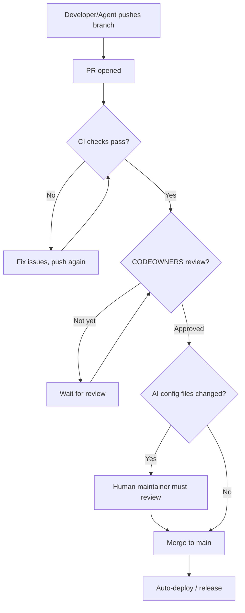

# Branch Protection

> [!WARNING]
> **Branch protection prevents your worst-case scenario: losing work to a bad force-push or an accidental merge.** If you're a solo developer thinking "I'm the only one working on this, why do I need protection?" — that's exactly when you need it. There's no teammate to catch your mistake, no code review to stop a bad merge, and no IT department to recover your history. You are the entire team, which means you're also the only person who can accidentally destroy everything.

A single `git push --force` to an unprotected `main` branch can erase your entire commit history. It has happened to solo developers — one bad command and weeks of work vanish with no way to recover it. Branch protection is a seatbelt, not enterprise governance. It takes 30 seconds to enable and costs nothing. You hope you never need it, but when you do, it saves everything.

> **Protection at a Glance** -- Require PR reviews, CI checks, signed commits, and linear history on `main`. AI agents must use PRs and cannot self-approve. CODEOWNERS gates AI config file changes behind human review.
>
> | Protection | Status | Notes |
> |------------|--------|-------|
> | PR required before merge | Required | At least 1 approval |
> | CODEOWNERS review | Required | For AI config files |
> | Status checks (CI, CodeQL) | Required | Must pass before merge |
> | Signed commits | Recommended | Proves authorship |
> | Linear history | Recommended | Enforces rebase/squash |
> | Force push / deletion | Blocked | On `main` and `v*` tags |

---

## Settings Checklist

Apply to the `main` branch (or your default branch):

- [x] **Require a pull request before merging**
  - [x] Require at least 1 approval
  - [x] Dismiss stale reviews when new commits are pushed
  - [x] Require review from CODEOWNERS
- [x] **Require status checks to pass before merging**
  - [x] Require branches to be up to date
  - [x] Add required checks: `ci`, `codeql`, `dependency-review`
- [x] **Require signed commits** (optional but recommended)
- [x] **Require linear history** (optional, enforces rebase/squash)
- [x] **Do not allow bypassing the above settings**
- [x] **Restrict who can push to matching branches**
  - Only maintainers; AI agents must use pull requests
- [x] **Do not allow force pushes**
- [x] **Do not allow deletions**

## Apply via GitHub CLI

```bash
# Requires gh CLI authenticated with admin access
# Adjust owner/repo and required checks for your project

OWNER="your-username"
REPO="your-repo"

gh api \
  --method PUT \
  "repos/$OWNER/$REPO/branches/main/protection" \
  -f 'required_status_checks[strict]=true' \
  -f 'required_status_checks[contexts][]=ci' \
  -f 'required_status_checks[contexts][]=codeql' \
  -f 'required_pull_request_reviews[dismiss_stale_reviews]=true' \
  -f 'required_pull_request_reviews[require_code_owner_reviews]=true' \
  -F 'required_pull_request_reviews[required_approving_review_count]=1' \
  -f 'enforce_admins=true' \
  -f 'restrictions=null' \
  -f 'required_linear_history=true' \
  -f 'allow_force_pushes=false' \
  -f 'allow_deletions=false'

echo "Branch protection applied to main"
```

## Protected Tags

Protect release tags to prevent tampering:

```bash
# Protect v* tags (semver releases)
gh api \
  --method POST \
  "repos/$OWNER/$REPO/rulesets" \
  --input - <<'EOF'
{
  "name": "Protect release tags",
  "target": "tag",
  "enforcement": "active",
  "conditions": {
    "ref_name": {
      "include": ["refs/tags/v*"],
      "exclude": []
    }
  },
  "rules": [
    { "type": "deletion" },
    { "type": "non_fast_forward" },
    { "type": "update" }
  ]
}
EOF
```

## PR Flow



## AI Agent Note

AI coding agents (Claude Code, Cursor, Copilot, Gemini, Windsurf) must always work
via pull requests. They should never have direct push access to protected branches.

CODEOWNERS requires human review for changes to AI configuration files
(`CLAUDE.md`, `AGENTS.md`, `GEMINI.md`, `.cursorrules`, `.windsurfrules`,
`.github/copilot-instructions.md`). This prevents prompt injection via PRs.

See [AI-SECURITY.md](AI-SECURITY.md) for more on prompt injection defense.

## Automated Setup

> [!IMPORTANT]
> The `secure-repo.sh` script is the fastest way to apply baseline protections. It configures force-push blocking, deletion blocking, Dependabot, and tag protection in one command. For full control over PR reviews, status checks, and signed commits, use the manual `gh api` commands above.

```bash
bash scripts/secure-repo.sh
```

## Commit Signing

> [!TIP]
> Signed commits show a **"Verified"** badge on GitHub, proving the commit was authored by the claimed identity. This is especially valuable for open source projects where contributor trust matters.

Signed commits prove authorship and prevent impersonation. This is optional but recommended, especially for public repos and open source contributions.

### SSH Signing (Recommended)

Most modern setups (GitHub, 1Password, etc.) support SSH-based signing:

```bash
# Configure git to use SSH signing
git config --global gpg.format ssh
git config --global user.signingkey ~/.ssh/id_ed25519.pub
git config --global commit.gpgsign true

# Add the key to GitHub: Settings > SSH and GPG keys > New SSH key (type: Signing Key)
```

### GPG Signing

```bash
# List keys
gpg --list-secret-keys --keyid-format=long

# Configure git
git config --global user.signingkey YOUR_KEY_ID
git config --global commit.gpgsign true
```

### Verify

After setup, your commits will show as **"Verified"** on GitHub.

## Fork-Specific Protection

If this repo is a fork, see [FORK-SECURITY.md](FORK-SECURITY.md) for:
- Upstream push blocking
- Fork network data leakage risks
- Sync workflow
- Branch hygiene for contributors
