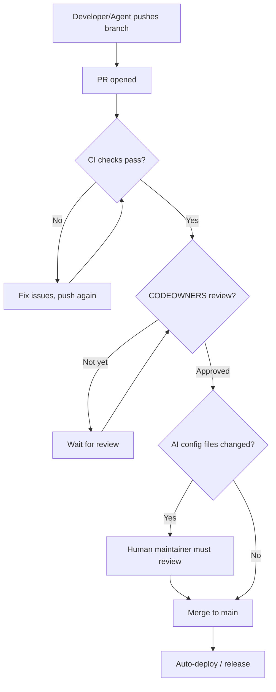

# Branch Protection

Recommended branch protection settings for this repository.

## Settings Checklist

Apply to the `main` branch (or your default branch):

- [x] **Require a pull request before merging**
  - [x] Require at least 1 approval
  - [x] Dismiss stale reviews when new commits are pushed
  - [x] Require review from CODEOWNERS
- [x] **Require status checks to pass before merging**
  - [x] Require branches to be up to date
  - [x] Add required checks: `ci`, `codeql`, `dependency-review`
- [x] **Require signed commits** (optional but recommended)
- [x] **Require linear history** (optional, enforces rebase/squash)
- [x] **Do not allow bypassing the above settings**
- [x] **Restrict who can push to matching branches**
  - Only maintainers; AI agents must use pull requests
- [x] **Do not allow force pushes**
- [x] **Do not allow deletions**

## Apply via GitHub CLI

```bash
# Requires gh CLI authenticated with admin access
# Adjust owner/repo and required checks for your project

OWNER="your-username"
REPO="your-repo"

gh api \
  --method PUT \
  "repos/$OWNER/$REPO/branches/main/protection" \
  -f 'required_status_checks[strict]=true' \
  -f 'required_status_checks[contexts][]=ci' \
  -f 'required_status_checks[contexts][]=codeql' \
  -f 'required_pull_request_reviews[dismiss_stale_reviews]=true' \
  -f 'required_pull_request_reviews[require_code_owner_reviews]=true' \
  -F 'required_pull_request_reviews[required_approving_review_count]=1' \
  -f 'enforce_admins=true' \
  -f 'restrictions=null' \
  -f 'required_linear_history=true' \
  -f 'allow_force_pushes=false' \
  -f 'allow_deletions=false'

echo "Branch protection applied to main"
```

## Protected Tags

Protect release tags to prevent tampering:

```bash
# Protect v* tags (semver releases)
gh api \
  --method POST \
  "repos/$OWNER/$REPO/rulesets" \
  --input - <<'EOF'
{
  "name": "Protect release tags",
  "target": "tag",
  "enforcement": "active",
  "conditions": {
    "ref_name": {
      "include": ["refs/tags/v*"],
      "exclude": []
    }
  },
  "rules": [
    { "type": "deletion" },
    { "type": "non_fast_forward" },
    { "type": "update" }
  ]
}
EOF
```

## PR Flow



## AI Agent Note

AI coding agents (Claude Code, Cursor, Copilot, Gemini, Windsurf) must always work
via pull requests. They should never have direct push access to protected branches.

CODEOWNERS requires human review for changes to AI configuration files
(`CLAUDE.md`, `AGENTS.md`, `GEMINI.md`, `.cursorrules`, `.windsurfrules`,
`.github/copilot-instructions.md`). This prevents prompt injection via PRs.

See [AI-SECURITY.md](AI-SECURITY.md) for more on prompt injection defense.
