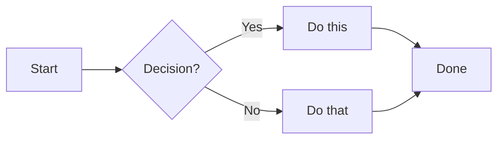
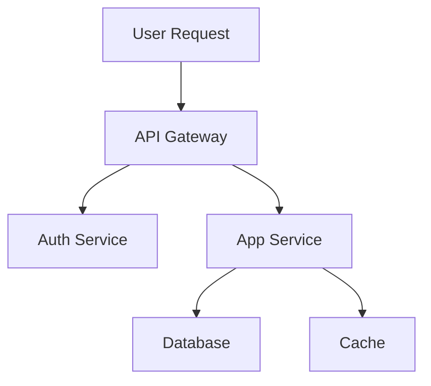
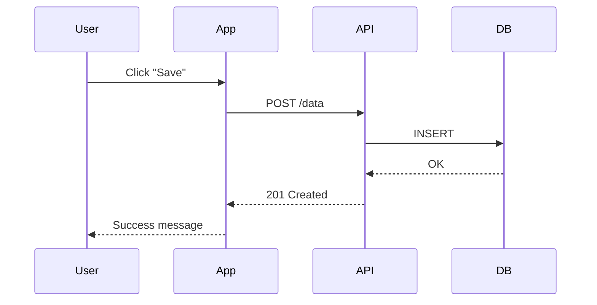
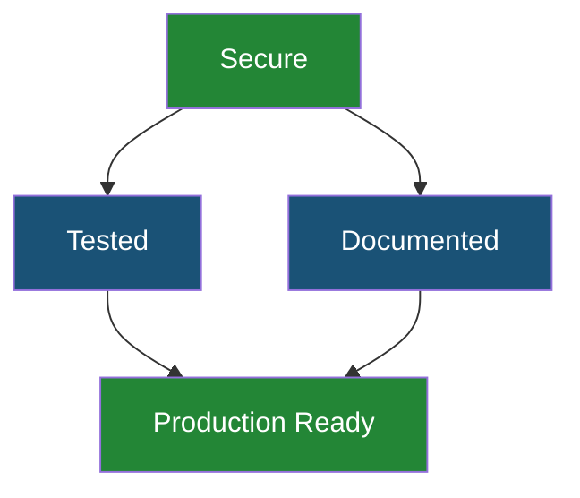

# Documentation Guide

> A pattern library for writing professional documentation. Covers README structure, Mermaid diagrams, GitHub callouts, progressive disclosure, badges, tables, and inline comments. Use these patterns to make your repo look like it was set up by a team that knows what they're doing.

---

## README Structure

Every README should follow this structure. Readers skim — put the most important information first and let them go deeper only if they want to.

```markdown
# Project Name

[](LICENSE)
[](https://github.com/OWNER/REPO/actions/workflows/ci.yml)

One paragraph: what it does, who it's for, why it exists.

> **New here?** Start with the [Getting Started Guide](docs/GETTING-STARTED.md).

## Why This Exists        <-- The problem it solves (2-3 sentences)
## Features               <-- Bullet list of what you get
## Quick Start            <-- 3-5 commands to get running
## What's Included        <-- Directory structure or feature map
## Usage                  <-- Detailed usage instructions
## FAQ                    <-- Common questions (use <details>)
## Contributing           <-- Link to CONTRIBUTING.md
## Security               <-- Link to SECURITY.md
## License                <-- One line + link to LICENSE
```

**Key principles:**
- The first screen of the README is the only part most people read
- Lead with outcomes ("prevents API key leaks") not features ("configures secret scanning")
- Keep the README under 2 screens for the main content — use links for details

---

## At-a-Glance Summary Pattern

Start every documentation file with a blockquote summary. This tells the reader what the document covers in one glance, so they can decide whether to keep reading.

```markdown
> **Security at a glance:** We follow a 6-layer defense model — from
> GitHub-native features through pre-commit hooks to runtime protection.
> Vulnerabilities should be reported privately via GitHub's advisory system.
```

Good summaries answer: **what is this document about** and **what's the most important thing to know**.

---

## Mermaid Diagrams

GitHub renders Mermaid diagrams natively in Markdown. Use them to explain flows, architectures, and relationships that are hard to describe in text.

### Flowchart (left to right)

Best for: processes, user journeys, pipelines.



### Flowchart (top to bottom)

Best for: hierarchies, layered systems, defense-in-depth.



### Sequence Diagram

Best for: interactions between systems, API call flows, time-ordered events.



### Graph with Styled Nodes

Best for: drawing attention to specific nodes, showing status.



**Tips:**
- Keep diagrams small (5-10 nodes). Larger diagrams become unreadable.
- Use `<br/>` for line breaks inside node labels.
- Use `style` to highlight the most important nodes.
- Copy the code above directly — GitHub renders Mermaid natively in fenced code blocks.

---

## GitHub Callouts

GitHub supports 5 callout types. Each has a specific purpose — don't use WARNING when you mean TIP.

Syntax: `> [!TYPE]` followed by the message on the next line(s), each starting with `>`.

> [!NOTE]
> **NOTE** — Supplementary information. Background context, clarifications, "by the way" details.

> [!TIP]
> **TIP** — Helpful advice. Shortcuts, best practices, recommendations that save time.

> [!IMPORTANT]
> **IMPORTANT** — Crucial information. Missing this would cause problems.

> [!WARNING]
> **WARNING** — Potential issues. Things that could go wrong, common mistakes.

> [!CAUTION]
> **CAUTION** — Dangerous actions. Irreversible operations, security-critical warnings, data loss risks.

---

## Progressive Disclosure with Details

Use `<details>` sections to hide information that most readers don't need on first read. This keeps the page scannable while making deep information available. Wrap the content in `<details>` and `<summary>` tags:

```html
<details>
<summary><strong>Click to expand</strong></summary>
Hidden content goes here. Supports full Markdown.
</details>
```

**When to use details:**
- FAQ answers
- Setup instructions for alternative configurations
- Deep technical explanations that only some readers need
- Long code examples
- Troubleshooting steps

**When NOT to use details:**
- Critical information (use callouts instead)
- The main content of the document
- Anything the primary audience needs to see

---

## Badge Patterns

Badges provide visual status indicators at the top of your README. Use [shields.io](https://shields.io) to generate them.

```markdown
[](https://github.com/OWNER/REPO/actions/workflows/ci.yml)
[](LICENSE)
[](https://github.com/OWNER/REPO/releases)
[](https://github.com/vbonk/repo-template)
```

**Rules:**
- Keep to 3-5 badges maximum — more than that creates visual clutter
- Put the most important badge first (CI status, version)
- Don't use badges that are always green — they add no information

---

## Table Formatting

Tables work best for structured comparisons and reference information.

```markdown
| Feature | Free | Pro | Enterprise |
|---------|------|-----|------------|
| Secret scanning | Public repos | All repos | All repos + custom patterns |
| Branch protection | Basic | Full | Full + rulesets |
| Code scanning | CodeQL | CodeQL + third-party | All tools |
```

**Tips:**
- Align content left (default) for text, right for numbers
- Keep tables narrow — wide tables break on mobile
- Use tables for structured data, not for layout
- Bold the first column when it serves as a label

---

## Cross-Reference Linking

Use relative links between documentation files. This keeps links working when the repo is cloned locally.

```markdown
<!-- From docs/GETTING-STARTED.md linking to docs/AI-SECURITY.md -->
See [AI Security](AI-SECURITY.md) for the full threat model.

<!-- From README.md linking to docs/ -->
See [Getting Started](docs/GETTING-STARTED.md) for the setup guide.

<!-- From docs/ linking to root files -->
See [SECURITY.md](../SECURITY.md) for vulnerability reporting.
```

**Conventions:**
- Always use relative paths, not absolute URLs
- Link to `.md` files, not rendered GitHub URLs
- Include anchor links for specific sections: `[Branch Protection](BRANCH-PROTECTION.md#setup)`
- Test links by clicking them on GitHub after pushing

---

## Inline Comments: The Docs They Actually Read

Your audience reads inline comments more than any documentation file. When someone generates code with an AI tool and then looks at what was created, the comments are the first (and often only) explanation they see.

```python
# Why: AI-generated code often misses CSRF protection.
# This middleware adds it to every form submission.
app.use(csrf_protection())

# Why: .env files contain secrets (API keys, passwords).
# This line prevents them from being committed to git.
# See: docs/GETTING-STARTED.md Level 3 for the full security model.
.env
```

**Guidelines:**
- Comment the **why**, not the **what** — the code shows what it does
- Use `# TODO(#123): description` format for outstanding work
- Never use `# TODO: fix later` without a ticket reference
- Link to documentation for deeper context: `# See: docs/AI-SECURITY.md`

---

## The What / Why / How Template

Every time you introduce a new concept, follow this structure:

```markdown
### Branch Protection

**What:** A GitHub setting that prevents force-pushes, branch deletion,
and merging without checks passing.

**Why:** Even solo developers need a safety net. A bad force-push can erase
your entire commit history. Branch protection prevents the most common
"oh no" moments.

**How:** Run `bash scripts/secure-repo.sh` to enable it automatically,
or configure manually in Settings > Branches > Add rule.
```

This pattern works because:
- Readers who just want to know what something is can stop after **What**
- Readers who need convincing read **Why**
- Readers who are ready to act jump to **How**
- Nobody has to read content they don't need

---

## Document Checklist

Before publishing any documentation file, verify:

- [ ] At-a-glance summary (blockquote) at the top
- [ ] "See also" links at the bottom
- [ ] All cross-reference links resolve (no broken links)
- [ ] At least one Mermaid diagram for complex flows
- [ ] GitHub callouts used appropriately (not overused)
- [ ] No placeholder text left behind (`<!-- TODO -->` cleared)
- [ ] Tables are narrow enough for mobile viewing
- [ ] Code blocks specify the language for syntax highlighting

---

> **See also:** [GETTING-STARTED.md](GETTING-STARTED.md) | [AI-SECURITY.md](AI-SECURITY.md) | [ARCHITECTURE.md](ARCHITECTURE.md) | [../CONTRIBUTING.md](../CONTRIBUTING.md)
