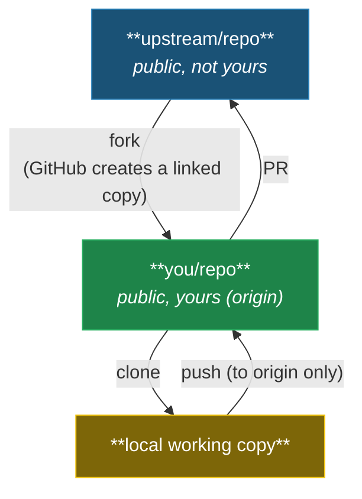

# Fork Security Guide

If you forked a public repo and pushed a secret, deleting the commit is not enough. GitHub shares object storage across the fork network — your "deleted" commit may still be fetchable from any repo in the fork graph. GitHub's garbage collection runs on an unpredictable schedule, and anyone with the commit SHA can retrieve the data from any repository in the network.

> [!WARNING]
> **29 million secrets were leaked on GitHub in 2025** (GitGuardian), and AI-assisted commits leak at twice the baseline rate. If you push a credential to a fork — even for a few seconds — bots can scrape it before you delete it, and the fork network's shared object store means your "deleted" commit may persist for weeks or months. **The only reliable fix is rotating the credential immediately.** Treat it as compromised from the moment it was pushed, then clean up history second.

> **Fork Security at a Glance** -- Forks share a git object store with the upstream repository. Deleted commits may still be fetchable by SHA from any repo in the fork network. If you accidentally push a secret, **rotate it immediately** -- deleting the commit is never sufficient. Always block upstream push, work on feature branches, and install pre-commit hooks.

---

## The Fork Model



## Critical Rules

### 1. Never Commit on the Default Branch

Keep `main` as a clean mirror of upstream. Always branch for your work:

```bash
git checkout -b feature/my-change
```

### 2. Block Upstream Push

Prevent accidental pushes to the parent repository:

```bash
git config remote.upstream.pushurl "NEVER_PUSH_TO_UPSTREAM_USE_PR"
```

Now `git push upstream` will always fail -- you must use PRs.

### 3. Review Before Pushing

Always check what you're about to push:

```bash
git diff origin/main...HEAD --stat   # What files changed
git log origin/main..HEAD --oneline  # What commits will be pushed
```

### 4. Sync Regularly

Keep your fork up to date with upstream:

```bash
git fetch upstream
git merge upstream/main
git push origin main
```

## Fork Network Data Leakage

> [!CAUTION]
> **This is the most important thing most people don't know about forks.**
>
> GitHub forks share a git object store. This means:
>
> - A commit pushed to your fork and then **deleted** (via force-push or branch deletion) may still be **fetchable from the upstream repo** by its SHA hash.
> - This applies to every repo in the fork network.
> - GitHub's garbage collection runs on an unpredictable schedule -- your "deleted" commit may persist for weeks or months.

> [!WARNING]
> **Rule: If you accidentally push a secret, ALWAYS rotate the credential immediately. Deleting the commit is NOT sufficient.**
>
> The secret should be considered compromised from the moment it was pushed, regardless of how quickly you remove the commit. Rotate first, clean up history second.

## What's Safe to Push

| Safe | Not safe |
|------|----------|
| Code changes on feature branches | `.env` files |
| Bug fixes, documentation | API keys, tokens, passwords |
| Config files using env vars | Hardcoded credentials |
| Test files | Files with local machine paths |
| New features | Internal hostnames or IPs |

## Contributing Upstream via PR

```bash
# 1. Create a feature branch
git checkout -b fix/improve-error-handling

# 2. Make changes, commit
git add -p
git commit -m "fix: improve error handling for edge case"

# 3. Push to YOUR fork (not upstream)
git push origin fix/improve-error-handling

# 4. Open PR to upstream
gh pr create --repo upstream-owner/upstream-repo
```

## Commit Identity

Your commits include your name and email. Check what's configured:

```bash
git config user.name
git config user.email
```

If you want to use GitHub's no-reply email (hides personal email):

```bash
git config user.email "username@users.noreply.github.com"
```

## Commit Signing

Signed commits prove authorship. Set up SSH signing (recommended):

1. Generate or select an SSH key
2. Add it to GitHub: **Settings > SSH and GPG keys > New SSH key** (type: Signing Key)
3. Configure git:
   ```bash
   git config --global gpg.format ssh
   git config --global user.signingkey ~/.ssh/id_ed25519.pub
   git config --global commit.gpgsign true
   ```

> [!TIP]
> See [BRANCH-PROTECTION.md](BRANCH-PROTECTION.md#commit-signing) for more details on SSH vs GPG signing and verification.

## Security Checklist for Fork Contributors

- [ ] Upstream push URL is blocked
- [ ] Pre-commit hooks installed (`bash templates/hooks/setup-hooks.sh`)
- [ ] Working on a feature branch (not main)
- [ ] No secrets in committed files
- [ ] Reviewed diff before pushing
- [ ] Commit email is appropriate for public visibility

## See Also

- [SECURITY.md](../SECURITY.md) -- Vulnerability reporting and incident response
- [BRANCH-PROTECTION.md](BRANCH-PROTECTION.md) -- Branch protection setup
- [AI-SECURITY.md](AI-SECURITY.md) -- Prompt injection defense
- [GITHUB-ENVIRONMENTS.md](GITHUB-ENVIRONMENTS.md) -- Deployment environments and secret scoping
