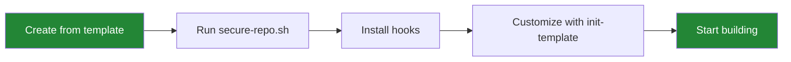
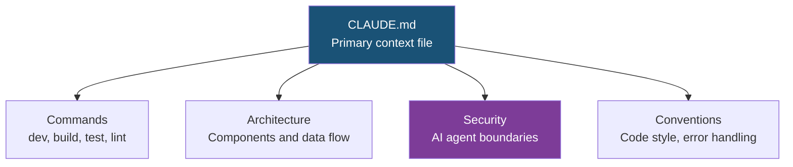
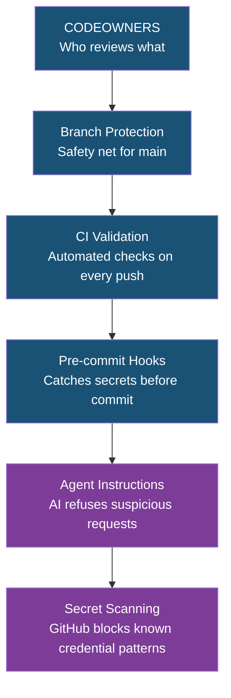
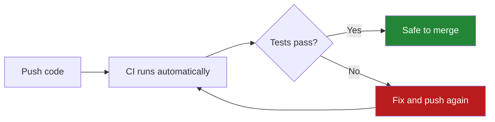

# Getting Started

> This guide takes you from "I have a new repo" to "my repo is production-grade" in about 10 minutes. It covers security, AI agent configuration, workflow persistence, and automation — the same things a senior engineering team would set up on day one.

---

## Prerequisites

- **Git** — installed and configured
- **GitHub CLI (`gh`)** — required for repo creation and security hardening. [Install guide](https://cli.github.com/). Run `gh auth login` to authenticate.
- **An AI coding tool** (optional) — Claude Code, Cursor, Copilot, etc. The template works without one, but the AI agent configs are a major feature.

> [!NOTE]
> Most template features work without `gh` (the `.gitignore`, AI configs, issue templates, and workflows all transfer via "Use this template"). The CLI is needed for `secure-repo.sh` (security hardening) and `audit-compliance.sh` (scoring). If you skip it, you can configure security settings manually in GitHub's Settings UI.

---

## Level 1: Your Repo, Production-Grade

**Time: 2 minutes.**

Three commands. That's it.

```bash
# 1. Create your repo from the template
gh repo create my-project --template vbonk/repo-template --public --clone
cd my-project

# 2. Harden security (Dependabot, branch protection, tag protection)
bash scripts/secure-repo.sh

# 3. Install pre-commit hooks (catches secrets before they reach git)
bash templates/hooks/setup-hooks.sh
```

> [!IMPORTANT]
> 29 million secrets were leaked on GitHub in 2025. AI-assisted commits leak credentials at twice the baseline rate (3.2% vs 1.5%). The pre-commit hook you just installed is a 3-second check that catches the most common and costly mistake before it happens.

### What just happened

Here is what those three commands configured for you:

| Command | What It Did |
|---------|-------------|
| `gh repo create --template` | Created a new repo with CI, issue templates, security policies, AI agent configs, and documentation scaffolding |
| `secure-repo.sh` | Enabled Dependabot alerts, branch protection (blocks force-push and branch deletion), tag protection, and delete-branch-on-merge |
| `setup-hooks.sh` | Installed a pre-commit hook that scans every commit for API keys, private keys, and credentials |

### Before and after

```
Before                              After
------                              -----
No .gitignore (or minimal)          Comprehensive .gitignore covering secrets,
                                    IDE files, OS files, build artifacts

No CI                               CI pipeline ready for Node, Python, Go, Rust

No security scanning                Secret scanning at commit + PR + push level

Force-push to main allowed          Branch protection enforced

No issue structure                  5 templates, 25+ labels, helper scripts

AI agents start cold                7 agent configs with project context
```



> [!TIP]
> Adding `.env` to `.gitignore` prevents 89% of accidental secret leaks. Your new repo's `.gitignore` already covers `.env`, `.env.local`, `.env.*.local`, `.pem`, `.key`, and dozens of other sensitive patterns.

---

## Level 2: Your AI Agent, Project-Aware

**Time: 5 minutes.**

AI coding agents perform dramatically better when they have context about your project. Without it, every session starts cold — the agent doesn't know your conventions, your stack, your architecture, or your security boundaries.

### What the agent config files do

This template includes configuration files for 7 AI coding agents. Each one tells the agent about your project so it's productive from the first session.

| Agent | Config File | What It Gives the Agent |
|-------|-------------|-------------------------|
| Claude Code | `CLAUDE.md` | Full project context, custom slash commands, security boundaries |
| GitHub Copilot | `.github/copilot-instructions.md` | Code generation guidelines, security rules |
| Cursor | `.cursorrules` | Architecture, testing, workflow conventions |
| OpenAI Codex | `AGENTS.md` | Cross-agent compatibility layer |
| Google Gemini | `GEMINI.md` | Commands, conventions, project structure |
| Windsurf | `.windsurfrules` | Same depth as Cursor config |
| Aider | `.aider.conf.yml` | Model selection, git settings, lint/test commands |

You don't need all 7. Use whichever tools you work with — they're independent files, not a package deal. If you only use Copilot, the tuned `copilot-instructions.md` is ready. If you use Claude Code and Cursor, both get project-specific context from day one.

### Why this matters

**Without context**, an AI agent:
- Doesn't know your project structure or naming conventions
- Generates code that doesn't match your style
- Misses your test patterns and deployment targets
- Has no security boundaries — it will happily commit secrets if asked

**With context**, the agent:
- Knows your commands (`npm test`, `cargo build`, etc.)
- Follows your coding style and architecture patterns
- Refuses requests that violate security rules
- Checks for security hardening on its first session

> [!NOTE]
> Over 40% of junior developers deploy AI-generated code they don't fully understand. The agent config files include security boundaries that instruct the AI to refuse suspicious requests and flag anything that touches credentials or security-sensitive files.

### How to customize

Run the interactive setup command in Claude Code:

```
/project:init-template
```

This walks you through filling in your project name, tech stack, and commands. All 7 agent config files update to reflect your project. You can also do it manually — every placeholder is marked with `<!-- TODO -->` comments:

```bash
grep -r "TODO" --include="*.md" CLAUDE.md AGENTS.md GEMINI.md
```



---

## Level 3: Your Workflow, Protected

**Time: 5 minutes.**

### Branch protection: a safety net, even for solo developers

**What it is:** Branch protection prevents anyone (including you) from force-pushing to `main`, deleting `main`, or merging broken code.

**Why it matters for solo devs:** "I'm the only one working on this, why do I need protection?" Because mistakes happen. A bad `git push --force` can erase your entire commit history. An accidental merge can overwrite hours of work. Branch protection is a seatbelt — you hope you never need it, but when you do, it saves everything.

**How it works:** After running `secure-repo.sh`, your `main` branch:
- Cannot be force-pushed (your history is safe)
- Cannot be deleted
- Merges automatically clean up feature branches

### Pre-commit hooks: the 3-second safety net

**What they are:** Pre-commit hooks are checks that run automatically every time you commit code. They take about 3 seconds and catch problems before they reach your repository.

**Why they matter:** The hook installed by `setup-hooks.sh` scans every commit for patterns that look like API keys, private keys, AWS credentials, GitHub tokens, and other secrets. This single step is the difference between "oops, I committed my API key" and "my API key is safe."

> [!WARNING]
> AI-generated code contains vulnerabilities 40-62% of the time. Zero out of 15 AI-built test apps in one study included CSRF protection. Zero set security headers. The pre-commit hook doesn't catch everything, but it catches the most expensive mistake — leaked credentials.

### Secret scanning: defense in depth

Your repository doesn't rely on a single line of defense. It uses 6 layers, each catching what the others miss:



If a secret slips past your local hook, the CI pipeline catches it. If it slips past CI, GitHub's secret scanning catches it. If push protection is enabled, GitHub blocks the push entirely before the secret ever lands in the repository.

### OWASP LLM Top 10: what matters for you

The OWASP LLM Top 10 is a security standard for applications that use large language models. Here are the items that directly affect you as someone using AI coding tools:

**Prompt injection** — When someone (or some code) includes hidden instructions that trick your AI agent into doing something unintended. This template protects AI config files with CODEOWNERS review gates and instructs agents to refuse suspicious requests. See [docs/AI-SECURITY.md](AI-SECURITY.md) for the full threat model.

**Sensitive information disclosure** — Your `.env` file contains API keys, database passwords, and other secrets. AI agents can accidentally include these in generated code or commit them. The pre-commit hook and `.gitignore` patterns prevent this. Never hardcode credentials in source files.

**Supply chain vulnerabilities** — AI agents sometimes suggest packages that don't exist. Attackers create real packages with those names (typosquatting). This template uses SHA-pinned GitHub Actions — every action is pinned to a specific commit hash, not a mutable tag that could be hijacked.

### Fork security basics

If you fork someone else's repository:

> [!CAUTION]
> Forks share a git object store with the upstream repository. A commit you push and then delete may still be fetchable from the upstream repo by its SHA hash. If you accidentally push a secret to a fork, rotate the credential immediately — deleting the commit is never sufficient.

See [docs/FORK-SECURITY.md](FORK-SECURITY.md) for the full guide, including how to block upstream push and contribute safely via PRs.

---

## Level 4: Your Development, Automated

**This section is optional.** Everything above gives you a production-grade repo. The items below add automation for teams and projects that grow beyond the basics.

### GitHub Actions: automated checks on every push

The included CI workflow (`.github/workflows/ci.yml`) runs automatically when you push code or open a pull request. It supports Node.js, Python, Go, and Rust — uncomment the section for your stack.



**What CI gives you:**
- Automated tests run on every push — you don't have to remember to run them manually
- Linting catches style issues before review
- Build verification confirms your code compiles
- Security scanning (CodeQL, dependency review) runs alongside your tests

### Issue templates and labels: structured task management

Run `bash scripts/labels.sh` to create 25+ labels organized by status, owner, priority, and type. The 5 issue templates (agent task, human task, external blocker, bug report, feature request) give structure to every task.

Helper scripts make GitHub Issues a task manager:

```bash
scripts/my-tasks.sh              # Your tasks + blocked issues
scripts/my-tasks.sh agent        # Tasks an AI agent can handle
scripts/my-tasks.sh high         # High priority only
scripts/close-issue.sh 23 "Done" # Close with status update
```

### Release automation

Tag a version and the release workflow creates a GitHub Release with an auto-generated changelog:

```bash
git tag v1.0.0
git push origin v1.0.0
# Release is created automatically with changelog from commits
```

### Compliance audit: scoring your repo

Run the compliance audit to score any repository against template standards:

```bash
bash scripts/audit-compliance.sh
```

This checks for AI agent configs, CI workflows, security features, community files, issue templates, and developer experience tooling. Output is JSON with a letter grade (A+ through F).

### Claude Code skills and agents

If you use Claude Code, explore the custom commands in `.claude/commands/`:

| Command | What It Does |
|---------|-------------|
| `/project:init-template` | Interactive project setup |
| `/project:security-audit` | Security scorecard (GitHub settings + local protections) |
| `/project:review` | Code review assistance |
| `/project:getting-started` | Walks through this guide interactively |
| `/project:update-docs` | Checks documentation quality and suggests improvements |

> [!TIP]
> Run `/project:security-audit` periodically to verify your security posture. It checks GitHub settings, pre-commit hooks, forbidden tokens, and commit signing, then outputs a letter grade.

---

## Quick Reference

| What You Want | Command |
|---------------|---------|
| Create repo from template | `gh repo create my-project --template vbonk/repo-template --public --clone` |
| Harden security | `bash scripts/secure-repo.sh` |
| Install hooks | `bash templates/hooks/setup-hooks.sh` |
| Interactive setup | `/project:init-template` (in Claude Code) |
| Run CI locally | `npm test` or your stack's equivalent |
| Create labels | `bash scripts/labels.sh` |
| Security scorecard | `/project:security-audit` or `bash scripts/audit-compliance.sh` |
| See your tasks | `bash scripts/my-tasks.sh` |

---

> **See also:** [AI-SECURITY.md](AI-SECURITY.md) | [BRANCH-PROTECTION.md](BRANCH-PROTECTION.md) | [FORK-SECURITY.md](FORK-SECURITY.md) | [ARCHITECTURE.md](ARCHITECTURE.md) | [DOCUMENTATION-GUIDE.md](DOCUMENTATION-GUIDE.md)
