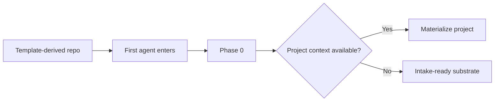

# Getting Started

> The normal workflow is intentionally short: create a repository from `vbonk/repo-template`, point Claude Code or Codex at it, and let the first agent normalize the template before introducing the real project.

**Last Updated:** 2026-08-13

## Agent-First Workflow

### 1. Create the repository

Use GitHub's **Use this template** action or your existing automation. The repository should already exist before the project agent enters it.

CLI example, when useful:

```bash
gh repo create my-project --template vbonk/repo-template --private --clone
```

### 2. Give the existing project agent the repository

If you have already been designing or building the project in a Claude Code or Codex session, keep that context. A typical instruction can be as small as:

> Organize and publish the project we have been working on to `owner/repo`.

The agent should not require a separate template explanation or repeat questions whose answers already exist in the current session.

### 3. Phase 0 runs first

A derived repository still contains source-template material. `CLAUDE.md` and `AGENTS.md` tell the first agent to execute [Phase 0](PHASE-0.md) automatically.

Phase 0:

- verifies whether the repo is pristine or already contains custom work;
- classifies inherited artifacts as KEEP / ADAPT / REMOVE / DEFER;
- removes template identity and false project assumptions;
- retains useful security/repository hygiene;
- ingests project material already available to the agent; or
- leaves a minimal intake-ready substrate if no real project has been provided yet.

No setup wizard is required.


```mermaid
flowchart LR
    A[Template-derived repo] --> B[First agent enters]
    B --> C[Phase 0]
    C --> D{Project context available?}
    D -->|Yes| E[Materialize project]
    D -->|No| F[Intake-ready substrate]
```

## What the Template Intentionally Does Not Assume

Before project intake, the template does not claim that the project uses:

- Node, Python, Go, Rust, Bun, or any other runtime;
- React, Next.js, Astro, Vite, or any framework;
- a database, CMS, authentication provider, analytics platform, or hosting target;
- particular build, test, lint, or deployment commands;
- specific environment variables;
- a public project license.

Those are project decisions, not template defaults.

## Security Baseline

Cleanup should not casually remove safeguards. Useful defaults include:

- secret-aware ignore patterns;
- repository security policy;
- CODEOWNERS protection for high-impact agent/security files where valid;
- pre-commit secret scanning;
- branch/ruleset hardening scripts;
- AI security boundaries;
- read-only security audit capability.

For a derived repository, Phase 0 keeps, adapts, or removes each control based on actual project needs.

See [AI-SECURITY.md](AI-SECURITY.md) and [BRANCH-PROTECTION.md](BRANCH-PROTECTION.md).

## If You Are Maintaining repo-template Itself

Do not run downstream normalization against `vbonk/repo-template`.

Use the source-template validation commands documented in `CLAUDE.md` and `AGENTS.md`, including:

```bash
bash scripts/test-template.sh --local-only
bash scripts/test-e2e.sh
bash scripts/audit-compliance.sh --local-only
bash scripts/secure-repo.sh --audit
```

## After Project Intake

The resulting repository should stop looking like `repo-template` and start looking like the actual project.

At that point:

- README describes the real project;
- `CLAUDE.md` and `AGENTS.md` contain real project operating instructions;
- architecture documentation reflects actual architecture;
- CI runs real project checks;
- dependency automation targets real ecosystems;
- environment documentation lists real required variables;
- ADRs record decisions that were actually made.

---

**Referenced by:** [README.md](../README.md)  
**See also:** [Phase 0](PHASE-0.md) | [Documentation Guide](DOCUMENTATION-GUIDE.md) | [AI Security](AI-SECURITY.md)
