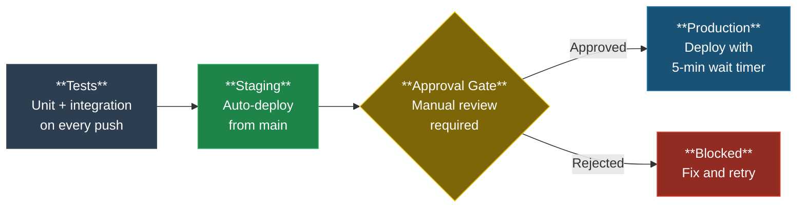

# GitHub Environments & Deployment Protection

> **Environments at a Glance** -- Use GitHub Environments to scope secrets per deployment target, require manual approval before production deploys, and limit which branches can trigger deployments. Staging auto-deploys from `main`; production requires human approval with a 5-minute cancellation window.

---

## What Are Environments?

GitHub Environments let you:
- Scope secrets to specific deployment targets (staging, production)
- Require manual approval before deploying
- Limit which branches can deploy
- Set wait timers before deployment proceeds

## Deployment Pipeline



## Setup

### 1. Create Environments

Go to **Settings > Environments > New environment** and create:

| Environment | Purpose | Approval | Branches |
|-------------|---------|----------|----------|
| `staging` | Pre-production testing | None (auto-deploy) | `main`, `develop` |
| `production` | Live deployment | 1+ reviewer | `main` only |

### 2. Configure Protection Rules

For each environment:

**Staging:**
- Required reviewers: none (auto-deploy)
- Deployment branches: `main`, `develop`
- No wait timer

**Production:**
- Required reviewers: 1+ (select your team)
- Deployment branches: `main` only
- Wait timer: 5 minutes (gives time to cancel)

### 3. Scope Secrets

Move deployment-specific secrets into environments:

```
Settings > Environments > production > Environment secrets
```

| Secret | Environment | Example |
|--------|-------------|---------|
| `DEPLOY_KEY` | production | SSH key for production server |
| `DATABASE_URL` | staging | Staging database connection |
| `API_TOKEN` | production | Production API credentials |

> [!NOTE]
> Environment-scoped secrets are only available to workflows running in that specific environment. They cannot be accessed by other jobs or environments in the same workflow.

### 4. Reference in Workflows

```yaml
jobs:
  deploy:
    runs-on: ubuntu-latest
    environment: production  # Triggers approval + scopes secrets
    steps:
      - name: Deploy
        env:
          DEPLOY_KEY: ${{ secrets.DEPLOY_KEY }}  # Only available in production env
        run: |
          echo "Deploying to production..."
```

## Workflow Pattern

> [!TIP]
> This is a complete, copy-paste-ready workflow that implements the test-staging-production pipeline shown above. Adjust the `run` commands for your deployment tooling.

```yaml
# deploy.yml
name: Deploy

on:
  push:
    branches: [main]

jobs:
  test:
    runs-on: ubuntu-latest
    steps:
      - uses: actions/checkout@SHA
      - run: npm test

  deploy-staging:
    needs: test
    runs-on: ubuntu-latest
    environment: staging
    steps:
      - run: echo "Deploy to staging"

  deploy-production:
    needs: deploy-staging
    runs-on: ubuntu-latest
    environment: production  # Requires approval
    steps:
      - run: echo "Deploy to production"
```

## Best Practices

> [!IMPORTANT]
> These practices prevent secret leakage and accidental production deployments -- the two most common environment-related incidents.

1. **Never put production secrets in repository-level secrets** -- use environment-scoped secrets
2. **Require approval for production** -- prevents accidental deploys
3. **Limit deployment branches** -- only `main` should deploy to production
4. **Use wait timers** -- gives a window to cancel bad deploys
5. **Audit regularly** -- review who has approval access

## See Also

- [GitHub Docs: Environments](https://docs.github.com/en/actions/deployment/targeting-different-environments/using-environments-for-deployment)
- [BRANCH-PROTECTION.md](BRANCH-PROTECTION.md) -- Branch-level protections
- [AI-SECURITY.md](AI-SECURITY.md) -- AI agent security and prompt injection defense
- [SECURITY.md](../SECURITY.md) -- Security policy
