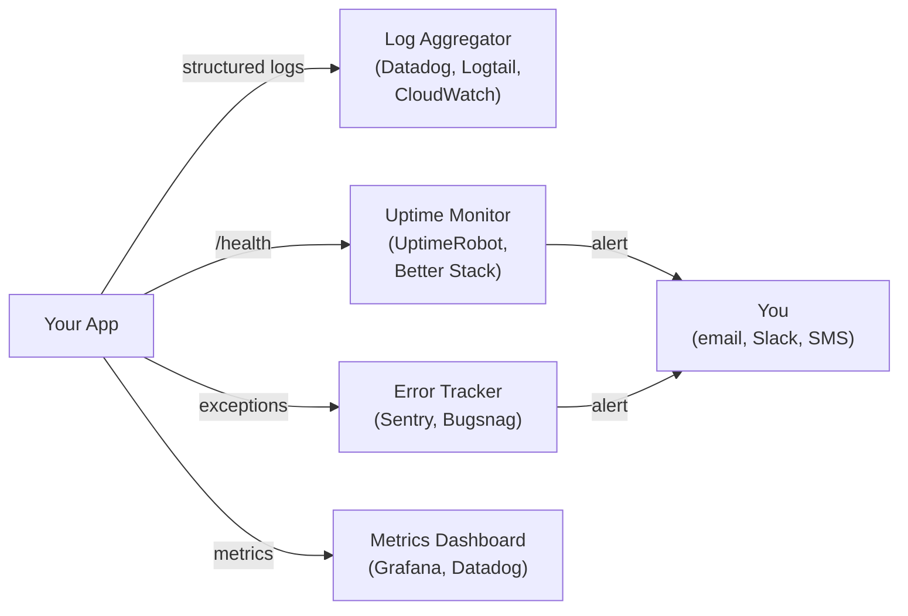
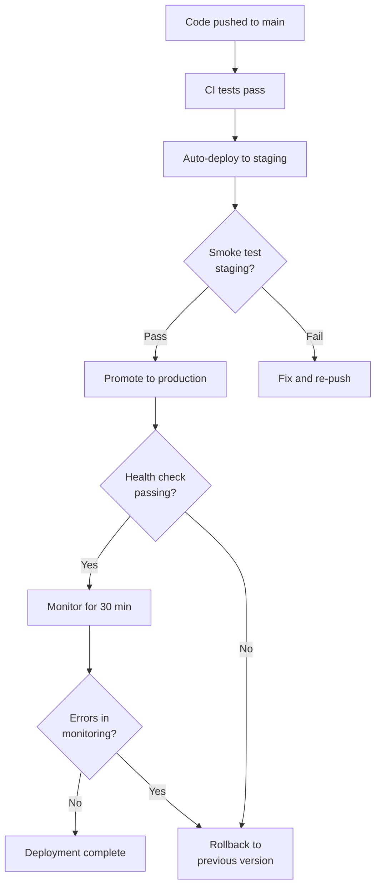
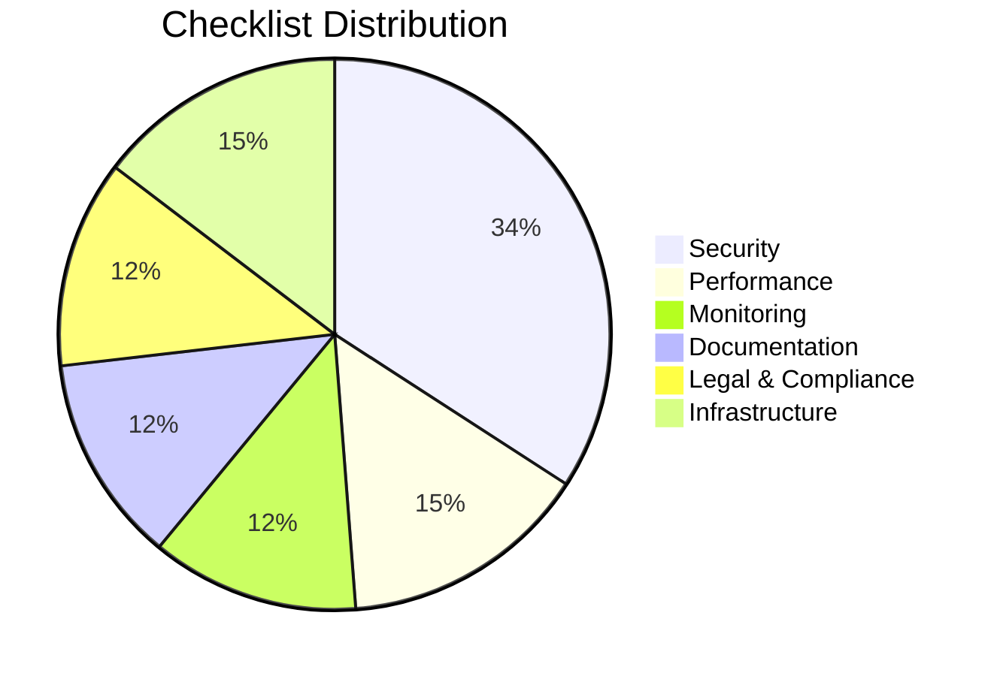

# Production Readiness Checklist

> **At a glance:** 40+ items across 6 categories to verify before you go live. Security leads because it is the #1 gap for solo developers using AI tools -- 29 million secrets were leaked on GitHub in 2025 alone. This checklist is designed for solo developers deploying their first production application. Not every item applies to every project -- use your judgment, but do not skip the Security section.

## Progress Tracker

Count the checked items as you go:

```
Checked: ___ / 41 items

Security:           ___ / 14
Performance:        ___ / 6
Monitoring:         ___ / 5
Documentation:      ___ / 5
Legal & Compliance: ___ / 5
Infrastructure:     ___ / 6
```

When all applicable items are checked, you are ready to ship.

---

## 1. Security

> [!CAUTION]
> Security is not optional. AI-generated code contains vulnerabilities 40-62% of the time. Zero out of 15 AI-built apps in a recent study included CSRF protection or security headers (Tenzai 2025). If you skip this section, you are shipping known risks.

- [ ] **All secrets in environment variables, not hardcoded.** AI tools sometimes hardcode credentials directly in source files -- search every file. Run `grep -r 'password\|secret\|api_key\|token' src/` and check for anything that looks like a real credential.

- [ ] **`.env` files in `.gitignore`.** Adding `.env` to `.gitignore` prevents 89% of accidental secret leaks (GitGuardian 2024). Check with: `grep '\.env' .gitignore`

- [ ] **No API keys, tokens, or passwords in git history.** Even if you removed a secret from the current code, it lives in git history forever. Check with:
  ```bash
  git log --all -p -S 'password' --diff-filter=A
  git log --all -p -S 'sk-' --diff-filter=A
  git log --all -p -S 'AKIA' --diff-filter=A
  ```
  If you find leaked secrets, rotate them immediately -- see [SECURITY.md](../SECURITY.md#-what-to-do-if-a-secret-is-leaked) for the full remediation steps.

- [ ] **HTTPS/TLS configured for all endpoints.** Every connection between your users and your server must be encrypted. Most hosting platforms (Vercel, Railway, Fly.io) provide this automatically -- verify it is active.

- [ ] **Authentication implemented for protected routes.** Any endpoint that reads or writes user data must verify the caller's identity. Test by accessing protected routes without credentials -- you should get a 401 or 403, not data.

- [ ] **CORS configured correctly (not wildcard `*` in production).** A wildcard CORS policy lets any website make requests to your API on behalf of your users. Set `Access-Control-Allow-Origin` to your actual domain(s).

- [ ] **Rate limiting on API endpoints.** Without rate limiting, a single attacker can overwhelm your server or burn through your paid API quota. At minimum, limit authentication endpoints (login, signup, password reset) to 10-20 requests per minute per IP.

- [ ] **Input validation on all user inputs.** Validate type, length, and format on every field that comes from a user. Never trust the client.

- [ ] **SQL injection prevention (parameterized queries).** Never build SQL queries by concatenating user input. Use parameterized queries or an ORM -- AI-generated code frequently gets this wrong.

- [ ] **XSS prevention (output encoding).** AI-generated code fails XSS prevention 86% of the time. Encode all user-supplied content before rendering it in HTML. Use your framework's built-in escaping (React does this by default; if you use raw HTML insertion, audit it carefully).

- [ ] **Security headers set.** These HTTP headers protect against common attacks with minimal effort:

  | Header | Value | Protects Against |
  |--------|-------|------------------|
  | `Content-Security-Policy` | `default-src 'self'` (adjust as needed) | XSS, data injection |
  | `X-Content-Type-Options` | `nosniff` | MIME-type confusion |
  | `X-Frame-Options` | `DENY` or `SAMEORIGIN` | Clickjacking |
  | `Strict-Transport-Security` | `max-age=31536000; includeSubDomains` | Downgrade attacks |
  | `Referrer-Policy` | `strict-origin-when-cross-origin` | Information leakage |
  | `Permissions-Policy` | `camera=(), microphone=(), geolocation=()` | Unwanted API access |

- [ ] **Dependencies audited for vulnerabilities.** Run your package manager's audit command and fix critical/high issues before deploying:
  ```bash
  npm audit          # Node.js
  pip audit          # Python (install: pip install pip-audit)
  govulncheck ./...  # Go
  cargo audit        # Rust
  ```

- [ ] **GitHub secret scanning enabled.** Go to your repo Settings > Code security > Secret scanning and enable it. This catches leaked credentials that your pre-commit hooks might miss.

- [ ] **Pre-commit hooks installed for credential scanning.** The hooks in this template catch secrets before they ever reach GitHub. If you have not set them up yet:
  ```bash
  bash templates/hooks/setup-hooks.sh
  ```
  See [SECURITY.md](../SECURITY.md) for the full security model.

> [!TIP]
> **Quick win:** Run `bash scripts/secure-repo.sh` to automatically enable GitHub secret scanning, push protection, Dependabot alerts, and branch protection in one command. This single script addresses 4 items on this list.

> [!WARNING]
> **Real-world incident:** A solo developer's exposed AWS key led to $3,200 in unauthorized charges within hours. Bots scrape GitHub for credentials within minutes of a push. AI-assisted commits leak secrets at 2x the baseline rate (3.2% vs 1.5%) -- GitGuardian 2026. If you use AI coding tools, you are at higher risk.

---

## 2. Performance

- [ ] **Database queries optimized.** Check for N+1 query problems (loading related records one at a time instead of in bulk). Add indexes on columns used in `WHERE`, `JOIN`, and `ORDER BY` clauses. Run `EXPLAIN ANALYZE` on your slowest queries.

- [ ] **Static assets served via CDN.** Serve images, CSS, JS, and fonts from a CDN (most deployment platforms include one). This reduces latency for users far from your server.

- [ ] **Caching strategy implemented.** Identify data that does not change on every request and cache it. Options in order of complexity:
  - HTTP cache headers (`Cache-Control`, `ETag`) -- free and effective
  - In-memory cache (Node.js `Map`, Python `lru_cache`) -- good for single-server
  - Redis or Memcached -- needed when you scale to multiple servers

- [ ] **Load testing performed.** Before launch, simulate at least your expected concurrent user count. Free tools: [k6](https://k6.io/), [autocannon](https://github.com/mcollina/autocannon) (Node.js), [locust](https://locust.io/) (Python). Even 5 minutes of load testing reveals problems you will not find any other way.

- [ ] **Image optimization (WebP, lazy loading).** Convert images to WebP format (30% smaller than JPEG). Add `loading="lazy"` to images below the fold. Use `srcset` for responsive images.

- [ ] **Bundle size checked (for frontends).** Large bundles kill your Core Web Vitals score and drive away users on slow connections. Check with:
  ```bash
  npx vite-bundle-analyzer   # Vite
  npx @next/bundle-analyzer  # Next.js
  npx webpack-bundle-analyzer  # Webpack
  ```

> [!TIP]
> **Quick win:** Add HTTP cache headers to your static assets. A single `Cache-Control: public, max-age=31536000, immutable` header on hashed asset URLs eliminates redundant downloads for returning users -- zero code changes required if your build tool hashes filenames.

---

## 3. Monitoring & Observability

> [!IMPORTANT]
> If you cannot see what your application is doing in production, you cannot fix it when it breaks. Monitoring is not a "nice to have" -- it is how you find out about problems before your users tell you (or leave).

- [ ] **Structured logging configured.** Replace `console.log` with a structured logger that outputs JSON (e.g., [pino](https://github.com/pinojs/pino) for Node.js, [structlog](https://www.structlog.org/) for Python). Structured logs let you search and filter in production. At minimum, every log entry should include a timestamp, severity level, and message.

- [ ] **Error tracking service connected.** Use [Sentry](https://sentry.io/) (free tier available), [Bugsnag](https://www.bugsnag.com/), or a similar service. These catch unhandled exceptions, group them, and alert you. Without error tracking, crashes happen silently.

- [ ] **Uptime monitoring configured.** Use a free service like [UptimeRobot](https://uptimerobot.com/), [Better Stack](https://betterstack.com/), or your hosting platform's built-in monitoring. At minimum, configure a ping check every 5 minutes with email alerts.

- [ ] **Health check endpoint exists.** Create a `GET /health` or `GET /api/health` endpoint that returns `200 OK` when the application is running and can connect to its database. Uptime monitors and load balancers use this endpoint to detect failures.

  ```
  GET /health
  200 OK
  { "status": "ok", "timestamp": "2026-03-29T12:00:00Z" }
  ```

- [ ] **Key metrics identified and tracked.** Decide what "healthy" looks like for your application and track it. Start with these four:
  - **Response time** (p50, p95, p99) -- how fast are you?
  - **Error rate** (5xx / total requests) -- how reliable are you?
  - **Active users** (concurrent sessions) -- how loaded are you?
  - **Database connection pool** -- are you running out of connections?



> [!TIP]
> **Quick win:** Add a `/health` endpoint and connect it to UptimeRobot (free for up to 50 monitors). This takes 10 minutes and you will know within 5 minutes if your app goes down.

> [!WARNING]
> **Real-world incident:** A solo developer's app was down for 3 days before they noticed -- they only found out when a user emailed them. Uptime monitoring would have alerted them in 5 minutes.

---

## 4. Documentation

- [ ] **README explains how to set up and run the project.** A new developer (or future you, 6 months from now) should be able to clone the repo and have a working development environment in under 10 minutes. Include: prerequisites, install steps, how to run, how to test.

- [ ] **API endpoints documented (if applicable).** If your project has an API, document every endpoint: method, path, request body, response format, authentication requirements, error codes. Tools: [Swagger/OpenAPI](https://swagger.io/), inline route comments, or a simple table in your README.

- [ ] **Environment variables documented in `.env.example`.** Every environment variable your app needs should be listed in `.env.example` with a description and example value (never a real credential). See [`.env.example`](../.env.example) in this template.

- [ ] **Deployment process documented.** Write down exactly how to deploy. Include: which branch triggers deployment, what environment variables need to be set in production, and how to roll back if something goes wrong. Future you will thank present you.

- [ ] **Architecture decisions recorded.** When you make a significant technical choice (database, framework, authentication method), write a short decision record explaining what you chose and why. See [docs/decisions/](decisions/) for the ADR template.

> [!TIP]
> **Quick win:** Copy your terminal history from the last time you set up the project and turn it into README setup instructions. Real commands you actually ran are more useful than idealized instructions.

---

## 5. Legal & Compliance

- [ ] **LICENSE file present and correct.** Without a license, your code is "all rights reserved" by default -- nobody can legally use, modify, or distribute it. If you want your project to be open source, add a license. Common choices:
  - **MIT** -- permissive, lets anyone do anything with attribution
  - **Apache 2.0** -- like MIT but with explicit patent grants
  - **GPL 3.0** -- copyleft, derivative works must also be open source

  See [choosealicense.com](https://choosealicense.com/) for a comparison.

- [ ] **Privacy policy linked (if collecting user data).** If your app collects any user data (names, emails, analytics, cookies), you need a privacy policy. Many jurisdictions require it by law. Free generators: [Termly](https://termly.io/), [PrivacyPolicies.com](https://www.privacypolicies.com/).

- [ ] **Terms of service linked (if offering a service).** If users create accounts or pay for your product, you need terms of service that define the rules of use, liability limitations, and dispute resolution.

- [ ] **Cookie consent implemented (if using cookies).** If you set cookies (including analytics cookies from Google Analytics, Plausible, etc.), users in the EU and many other jurisdictions must be able to accept or reject them. Use a consent banner library for your framework.

- [ ] **GDPR/data handling compliance reviewed (if serving EU users).** If any of your users are in the EU, you need to: allow data export, allow account deletion, explain what data you collect and why, and identify your lawful basis for processing. This applies even if you are not based in the EU.

> [!WARNING]
> **Real-world consequence:** GDPR fines start at 2% of annual global turnover or EUR 10 million (whichever is higher). Even solo developers and small startups have been fined. The "I'm too small to get noticed" defense does not work -- regulators often start enforcement with small companies to set precedents.

---

## 6. Infrastructure & Reliability

- [ ] **Backup strategy in place and tested.** Having backups is not enough -- you must test that you can restore from them. Schedule a monthly "fire drill" where you restore a backup to a test environment. If your database is managed (Supabase, PlanetScale, Railway), verify that point-in-time recovery is enabled and know how to trigger it.

- [ ] **Rollback procedure documented and tested.** Know how to revert to the previous working version before you need to do it under pressure. Document:
  - How to revert a deployment (e.g., `git revert` + push, or redeploy previous commit)
  - How to roll back a database migration
  - Who to contact if the hosting platform is involved

- [ ] **Environment variables differ between staging and production.** Never share database credentials, API keys, or secret keys between environments. If a staging leak compromises production, you have a much bigger problem. Verify with: "If I delete my staging database, does production keep running?"

- [ ] **Database migrations are reversible.** Every migration should have a corresponding "down" migration. Before deploying a migration, test the rollback path: migrate up, verify, migrate down, verify. Irreversible migrations (dropping columns, deleting tables) should be a two-step process: deprecate first, remove later.

- [ ] **Graceful shutdown handling (SIGTERM).** When your hosting platform deploys a new version, it sends `SIGTERM` to the old process. Your app should:
  1. Stop accepting new requests
  2. Finish processing in-flight requests (within a timeout)
  3. Close database connections cleanly
  4. Exit with code 0

  Without this, users experience dropped connections and database corruption during deployments.

- [ ] **DNS configured and propagated.** If you are using a custom domain, verify:
  - DNS records point to the correct IP/CNAME
  - SSL certificate is valid for the domain
  - `www` subdomain redirects to (or serves) the apex domain
  - Check propagation: `dig yourdomain.com +short` or [whatsmydns.net](https://www.whatsmydns.net/)



> [!TIP]
> **Quick win:** Set up a staging environment that mirrors production. Most hosting platforms (Vercel, Railway, Render) support preview deployments from branches at no extra cost. Test every change in staging before it reaches production.

> [!WARNING]
> **Real-world incident:** A developer ran an irreversible database migration in production (dropped a column) and discovered 2 hours later that a critical feature depended on it. Without backups, the data was gone. Always test migrations in staging first, and always have a rollback plan.

---

## Quick Reference



### Related Template Resources

| Resource | What It Does |
|----------|-------------|
| [`scripts/secure-repo.sh`](../scripts/secure-repo.sh) | Enables GitHub security features (secret scanning, push protection, Dependabot, branch protection) in one command |
| [`templates/hooks/setup-hooks.sh`](../templates/hooks/setup-hooks.sh) | Installs pre-commit hooks that block credential commits |
| [`.env.example`](../.env.example) | Environment variable documentation template |
| [`SECURITY.md`](../SECURITY.md) | Security policy and incident response procedures |
| [`docs/AI-SECURITY.md`](AI-SECURITY.md) | Threat model for AI-assisted development |
| [`docs/BRANCH-PROTECTION.md`](BRANCH-PROTECTION.md) | Branch protection setup guide |
| [`scripts/audit-compliance.sh`](../scripts/audit-compliance.sh) | Audit your repo against template standards |

---

> **See also:** [SECURITY.md](../SECURITY.md) | [AI-SECURITY.md](AI-SECURITY.md) | [ARCHITECTURE.md](ARCHITECTURE.md) | [README.md](README.md)
